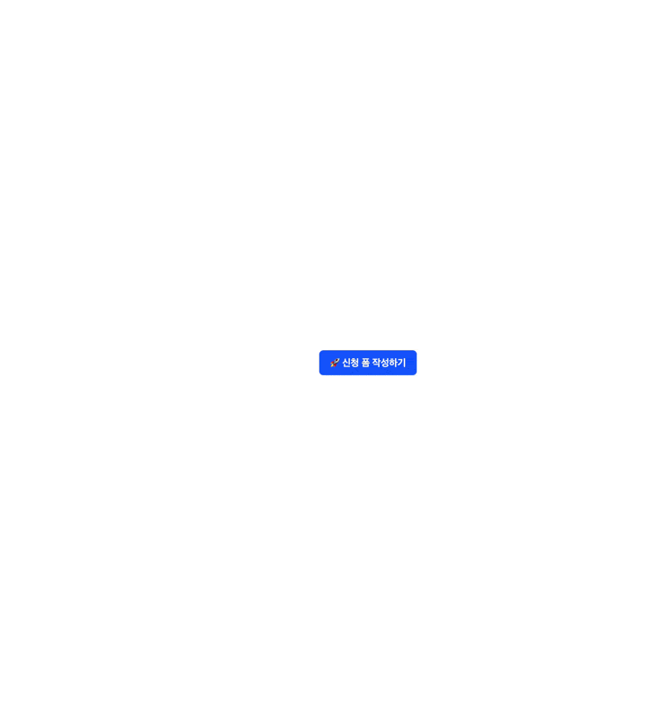

## 결과

웹 접근성을 연구하는 WAI 기관에서 제시한 WCAG 표준 스펙 2.1 AA 수준을 준수하고 있습니다.

## 테스트 방법

### 실행 방법

> pnpm dev

스크린리더를 활성화한 후 눈을 감고 키보드만으로 탭을 이동해보세요.

> 스크린리더 활성화 방법: `MacOS` / `cmd + F5`

## 목표

**제한 시간 안에 구현하는 것이 아닌, 충분한 시간이 있음을 가정하고 웹 접근성의 완성도에 중점을 두었습니다.**

## 회고

FEconf 컨퍼런스에서 웹 접근성이 미치는 영향에 대해 세션을 들은적은 있었으나, 웹 접근성을 깊이 고려하여 개발한적은 없었다. 
완성도에 목표를 두고자 했던 이유는 WCAG 표준을 지키고자 한다면 어떤 것을, 얼마나 깊이있게 고려하는지와, 내가 모르던 것들이 얼마나 있는지 확인하고 그것들을 학습하기 위한 것이었다.

종종 웹 서비스 혹은 애플리케이션 서비스에서 핸드폰 번호나 카드 번호를 입력할 때 모든 자리를 입력했음에도 불구하고 다음 항목으로 자동으로 넘어가지 않는 경우가 있다. 
또한 이메일을 입력하라는 `input` 임에도 불구하고 모바일에서 자동으로 이메일 입력 키보드 패드로 전환되지 않는 경우가 있다.(숫자 입력하라는 항목에 숫자 키보드 패드로 전환시켜주지 않는 것은 정말이지 사용자 경험에 좋지 않다.) 
이러한 서비스는 사용자에게 믿음을 줄 수 없을지도 모른다. 디테일이나 세심한 노력을 못하는 조직이라는 인식을 심어줄 수 있고 오류 처리나 보안은 잘 대비하고 있는걸까? 라는 의구심이 들 수도 있다. 
이런 인식이 서비스 브랜드에도 영향을 미칠 잠재력이 있다고 생각한다.

본 첼린지를 하면서 몇가지 중요한 깨달음 및 어려웠던 점

- 모달 내부에서만 탭 순환이 되도록 하는 과정에서 모달 뒤쪽 `HTML` 요소로 이동되는 탭을 어떻게 막지? 복잡할 것만 같았지만 HTML5 속성 inert을 이용하니 한번에 너무나도 잘 해결이 되었다.
  - 내가 모르는 유용한 `HTML` 속성이 더 있을거라 예상된다. `HTML` 표준 문서를 읽어보기로 다짐하게 됐던 놀라운 깨달음이었다.
- 웹 접근성을 향상하는 과정에서 시멘틱 태그 구조를 지키면서 원하는 흐름으로 스크린리더가 읽을 수 있도록 하는 방법을 알 수 있게 되었다.
  - WCAG 표준을 읽어보며 `form` 내부에서는 어떤 요소를 챙겨야 하는지 배울 수 있었다. WCAG 표준 문서를 읽도록 만들어준 과정이었다.
- `await openModal()` 형태로 사용 가능하도록 구현하는 과정에서 모달 폼 제출 시까지 어떻게 기다리게 할 수 있을까를 고민했었다.
  `await`이니까 `Promise` 객체를 사용하는 것은 맞는데 `Promise` 객체를 모달마다 props로 넘겨주기에는 너무 비효율적이고 근본적인 해결방법이 아니었다.
  모달을 `open`할 때 `element` 객체를 넘겨주는 구조이니 `cloneElement` 로 props를 넣어주면 어떨까라는 생각으로 접근했었다.
  `Promise` 객체를 자유자재로 다룰 수 있게 해준 경험이었다.

---

## 📋 챌린지 개요

React와 TypeScript를 사용하여 접근성을 지원하는 모달폼 컴포넌트를 구현하는 챌린지입니다.

---

## 🛠 기술 스택

코드 챌린지는 다음 필수 기술 스택을 포함하여 구현해야 해요.
UI 라이브러리나 다른 유틸리티 라이브러리 등 추가 기술 스택을 함께 사용하셔도 돼요.

- React
- TypeScript

---

## 🎯 챌린지 목표

- 프로젝트는 `npm run dev` || `yarn dev` || `pnpm dev`로 실행 가능해요.
- 코드의 구현은 `ModalFormPage.tsx` 파일에서부터 진행해주세요. 구조의 변경이 필요한 경우 자유롭게 진행해주셔도 돼요.

---

### 구현 요구사항

- **모달 닫기**
  - ESC 키 입력 또는 바깥 영역(overlay) 클릭 시 모달이 닫혀야 해요.
- **포커스 흐름**
  - 모달이 열리면 모달의 제목 요소로 포커스가 이동해야 하고, 닫히면 원래 버튼(트리거)으로 포커스가 돌아와야 해요.
  - Tab 키로 다음 요소로, Shift+Tab 키로 이전 요소로 이동할 수 있어야 해요.
- **폼 사용성**
  - 키보드만으로 입력하고 제출할 수 있어야 해요.
  - 제출 시 유효성 검증이 실패하면 오류 메시지가 표시되고, 스크린리더 사용자에게 즉시 전달되어야 해요
    - 검증을 위해 이메일 등 최소 한 개 이상의 필드에 유효성 검사가 포함되어야 해요.
- **UI/UX**
  - 모달이 열려 있을 때는 배경이 스크롤되지 않도록 막아야 해요.
  - 모달 안의 내용이 길어지면 내부에서 스크롤할 수 있어야 해요.
- **접근성**
  - `aria-modal`, `aria-labelledby`, `aria-describedby` 같은 기본 속성을 챙겨주세요.
  - 애니메이션은 `prefers-reduced-motion` 설정을 고려해 주면 더 좋아요.
- **선언적 호출**
  - 모달은 함수 호출을 통해 선언적으로 열 수 있어야 해요.
    - 예시로 `const result = await openFormModal()` 형태로 사용 가능해야 하며,
    - 제출 완료 시 입력값이 반환되고, 취소/닫기 시 `null`이 반환되어야 해요.

### 추가 구현 사항

- **중첩 모달**
  - 모달 안에 모달이 열릴 수 있는, 중첩 구조로 구현하였습니다.
  - ESC 키 입력과 외부 영역 클릭으로 하나의 모달을 닫을 수 있습니다.
- **모달 폼 제출 결과값을 상단 코드 블록으로 노출**
  - `제출하기` 버튼 이후 입력했던 값을 반환함과 동시에 상단에 코드 블록이 노출됩니다.
  - 중첩 모달의 경우 코드 블록의 값은 덮어씌워집니다.

---

## ⏱ 예상 소요 시간

2시간
